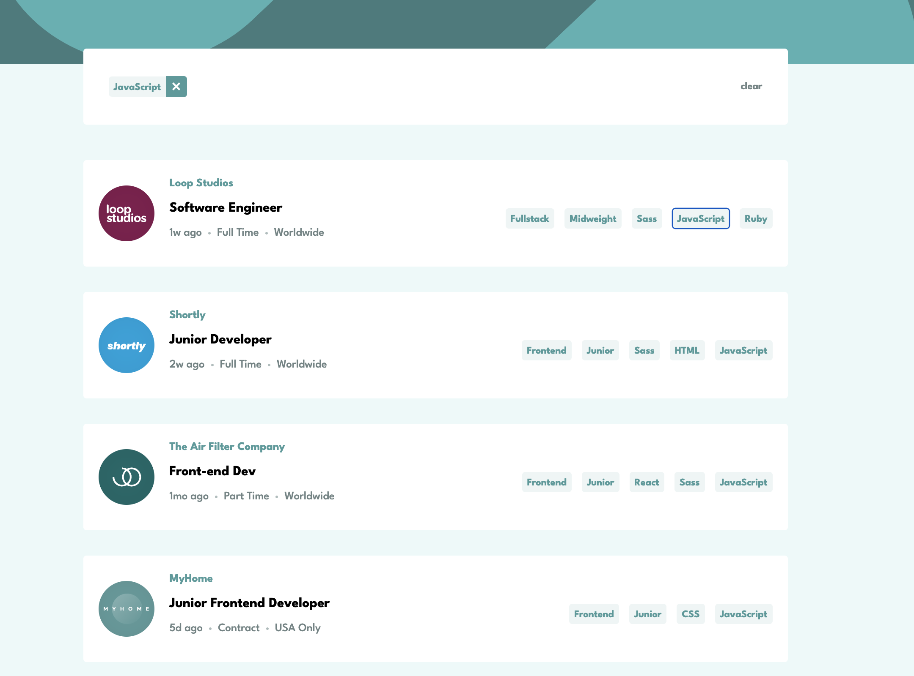

# Full-stack Job listings with filtering

## Table of contents

- [Overview](#overview)
  - [The challenge](#the-challenge)
  - [Links](#links)
  - [Screenshot](#screenshot)
- [My process](#my-process)

  - [Built with](#built-with)

- [Author](#author)

## Overview

### The challenge

Users should be able to:

- View the optimal layout for the site depending on their device's screen size
- See hover states for all interactive elements on the page
- Filter job listings based on the categories

### Links

- Live Demo: [https://job-listings-nextjs.vercel.app/](https://job-listings-nextjs.vercel.app/)

### Screenshots

## My process

### Built with

- Semantic HTML
- Tailwind
- Mobile-first workflow
- Next.js
- Supabase

**Note: These are just examples. Delete this note and replace the list above with your own choices**

## Author

- Portfolio - [aaronkagan.dev](https://www.aaronkagan.dev)
- Linkedin - [/aaron-kagan](https://www.linkedin.com/in/aaron-kagan/)
- X - [@aaronkagandev](https://www.twitter.com/aaronkagandev)
- Instagram - [aaronkagandev](https://www.instagram.com/aaronkagandev/)
